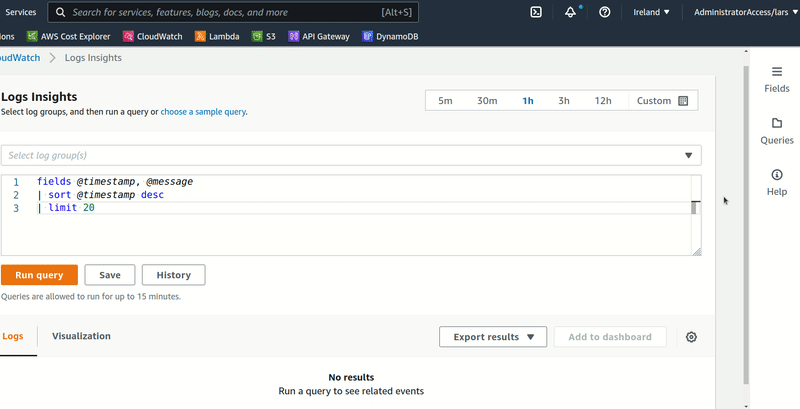

# cw-logs-insights-snippets

[Serverlessland.com/snippets](https://serverlessland.com/snippets) hosts a growing number of community provided snippets. Many of these are useful [CloudWatch Logs Insights](https://docs.aws.amazon.com/AmazonCloudWatch/latest/logs/AnalyzingLogData.html) snippets.

Until AWS integrates these in the console natively you can use this stack to get them there.

It's designed to poll the [GitHub repo](https://github.com/aws-samples/serverless-snippets) every 12 hours. This can be changed [here](https://github.com/ljacobsson/cw-logs-insights-snippets/blob/main/template.yaml#:~:text=Schedule%3A%20rate(12%20hours)). 

Note that if you have access to the repository settings you are better off using [webhooks directly to EventBridge](https://aws.amazon.com/about-aws/whats-new/2022/08/amazon-eventbridge-supports-receiving-events-github-stripe-twilio-using-webhooks/) instead of polling.

If a snippet is removed from the repo it will be removed from the AWS console after 48 hours via DynamoDB TTL expiry.

## Installation

* Clone this repo and `cd` to project root
* Get a recent version of [SAM-cli](https://docs.aws.amazon.com/serverless-application-model/latest/developerguide/serverless-sam-cli-install.html)
* `sam build --parallel --beta-features && sam deploy --guided`

A StepFunctions state machine will now run every 12 hours. You may want to kick it off manually the first time.
